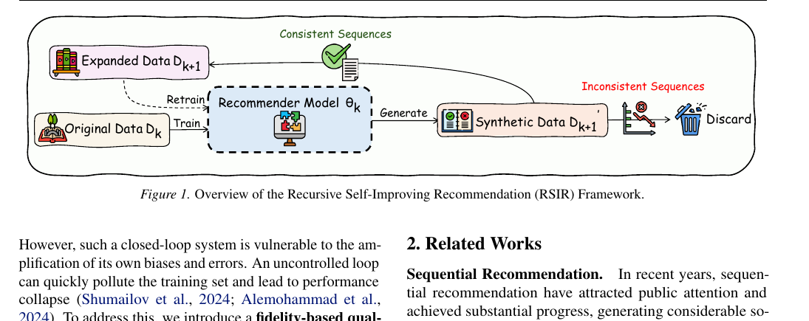
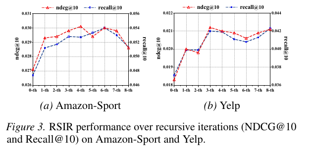
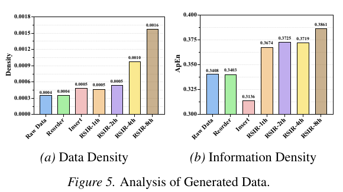
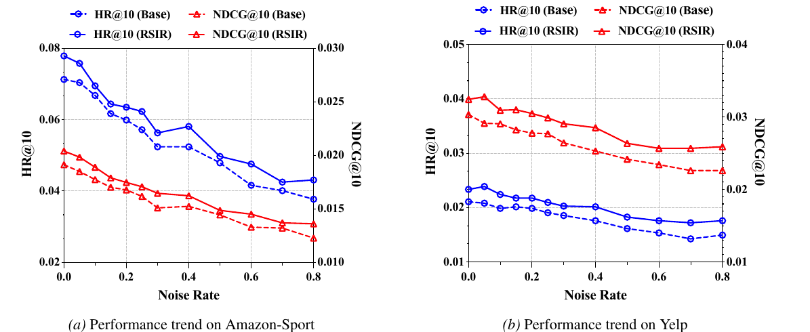

# RSIR: Recursive Self-Improving Recommendation

[](https://arxiv.org/abs/2602.15659)
[](https://icml.cc/)
[](https://github.com/USTC-StarTeam/RSIR)

Official code for the ICML 2026 paper on recursive self-improvement for sequential recommendation.

## 1. Paper

Luankang Zhang, Hao Wang, Zhongzhou Liu, Mingjia Yin, Yonghao Huang, Jiaqi Li, Wei Guo, Yong Liu, Huifeng Guo, Defu Lian, and Enhong Chen. **Can Recommender Systems Teach Themselves? A Recursive Self-Improving Framework with Fidelity Control.** In *Proceedings of the 43rd International Conference on Machine Learning (ICML 2026)*, Seoul, South Korea, 2026.

[Paper](https://arxiv.org/abs/2602.15659) / [PDF](https://arxiv.org/pdf/2602.15659) / [Project Page](https://ustc-starteam.github.io/RSIR/) / [Citation](#citation)

RSIR is a closed-loop framework for sequential recommendation. Instead of relying on external data or a separate teacher model, the current recommender generates plausible user interaction sequences, filters them through fidelity-based quality control, and trains a successor model on the enriched dataset.

## 2. Highlights

- **Recursive self-improvement:** a recommender uses its own predictive signal to generate additional training sequences.
- **Fidelity control:** generated sequences are accepted only when they remain consistent with the user's approximate preference manifold.
- **Cumulative gains:** the paper reports consistent improvements across recursive iterations, datasets, and backbone models.
- **No external teacher required:** RSIR improves sparse recommendation data without relying on LLM-generated data or curated side information.
- **Current code release:** this repository contains the SASRec implementation, the RSIR generation loop, evaluation utilities, and preprocessed data splits.

## 3. Method At A Glance

<p align="center">
  
</p>

At iteration `k`, RSIR performs four steps:

1. **Train** a recommendation model `theta_k` on the current dataset `D_k`.
2. **Generate** synthetic user interaction sequences with the trained model.
3. **Filter** generated steps through fidelity-based quality control.
4. **Retrain** a successor model on the expanded dataset `D_{k+1}`.

The main implementation path is:

| Paper concept | Repository entry point |
| --- | --- |
| Base recommender training | `run.py` with `--mode recommendation` |
| RSIR sequence generation | `run.py` with `--mode generation` |
| Fidelity check and sequence saving | `model/basemodel.py::generate_and_save_sequences_parallel` |
| Dataset loading by iteration suffix | `data/dataset.py` |
| SASRec backbone | `model/sasrec.py` |

## 4. Repository Structure

```text
RSIR/
|-- configs/              # Dataset, model, training, and generation configs
|-- data/                 # Dataset wrappers and loaders
|-- dataset/              # Preprocessed splits and generated iteration files
|-- evaluation/           # Ranking metrics
|-- model/                # Base model and SASRec implementation
|-- module/               # Layers, functional helpers, and augmentation modules
|-- quickstart/           # Training and generation routines
|-- utils/                # Arguments, config loading, logging, callbacks
\-- run.py                # Main command-line entry point
```

## 5. Installation

Create a Python environment and install the core dependencies:

```bash
conda create -n rsir python=3.8 -y
conda activate rsir

pip install torch numpy pandas pyyaml tqdm wandb torchmetrics matplotlib scipy faiss-cpu
```

If you use a CUDA-specific PyTorch build, install PyTorch from the official command for your CUDA version before installing the remaining packages.

## 6. Data

This release includes preprocessed splits and generated iteration files under `dataset/`.

| Dataset | Domain folder | Provided generated iterations |
| --- | --- | --- |
| Amazon-Beauty | `dataset/amazon-beauty/beauty/` | `train_1th.pth` |
| Amazon-Sport | `dataset/amazon-sport/sport/` | `train_1th.pth` to `train_8th.pth` |
| Amazon-Toys | `dataset/amazon-toys/toy/` | `train_1th.pth` |
| Yelp | `dataset/yelp/yelp/` | `train_1th.pth` to `train_8th.pth` |

Each dataset folder follows the same layout:

```text
inter.csv
train.pth
val.pth
test.pth
train_1th.pth
...
```

The command-line argument `--trainfile` controls which training file is loaded:

- `--trainfile ""` loads `train.pth`.
- `--trainfile "_1th"` loads `train_1th.pth`.
- `--trainfile "_8th"` loads `train_8th.pth`.

## 7. Quick Start

### 7.1 Train a base recommender

Train SASRec on the original Amazon-Toys training split:

```bash
python run.py -m SASRec -d amazon-toys --trainfile "" --mode recommendation --device 0
```

The best checkpoint is saved under the configured `eval.save_path`, currently `./saved/`.

### 7.2 Generate RSIR augmented data

After training, pass the checkpoint path to the generation mode:

```bash
python run.py \
  -m SASRec \
  -d amazon-toys \
  --trainfile "" \
  --mode generation \
  --theta_r_path saved/SASRec/amazon-toys/<checkpoint>.ckpt \
  --output_trainfile "_1th" \
  --device 0
```

The generation routine loads the trained model, creates synthetic sequences, applies the fidelity check, merges valid generated sequences with the original training data, and saves the result under the corresponding dataset folder.

The `--output_trainfile` argument controls the output suffix in generation mode. For example, `--output_trainfile "_1th"` saves:

```text
dataset/amazon-toys/toy/train_1th.pth
```

The same suffix is used later with `--trainfile "_1th"` when training or evaluating on the generated iteration.

### 7.3 Train on a generated iteration

Use a provided RSIR iteration file directly:

```bash
python run.py -m SASRec -d amazon-sport --trainfile "_8th" --mode recommendation --device 0
```

This command loads:

```text
dataset/amazon-sport/sport/train_8th.pth
```

## 8. Reproducing Paper Results

The paper evaluates RSIR on multiple recommendation datasets and backbones. This code release currently provides the SASRec path and pre-generated iteration files for direct verification.

Suggested verification commands:

```bash
# Original training data
python run.py -m SASRec -d amazon-sport --trainfile "" --mode recommendation --device 0

# RSIR 1st iteration
python run.py -m SASRec -d amazon-sport --trainfile "_1th" --mode recommendation --device 0

# RSIR 8th iteration
python run.py -m SASRec -d amazon-sport --trainfile "_8th" --mode recommendation --device 0
```

For Yelp:

```bash
python run.py -m SASRec -d yelp --trainfile "" --mode recommendation --device 0
python run.py -m SASRec -d yelp --trainfile "_8th" --mode recommendation --device 0
```

## 9. Generation Hyperparameters

Generation settings are configured in `configs/basemodel.yaml`:

| Key | Meaning |
| --- | --- |
| `generation.m` | Number of synthetic trajectories generated per user sequence |
| `generation.k` | Rank threshold used by the fidelity check |
| `generation.local_prob` | Probability of sampling from the user's historical item set |
| `data.max_seq_len` | Maximum sequence length |

The fidelity control step is implemented in `model/basemodel.py`. A generated step is accepted only when at least one remaining item from the user's real sequence is still ranked within the threshold after the synthetic context update.

## 10. Experimental Highlights

The paper reports results across four datasets and three sequential recommendation backbones. The tables and figures below summarize the main empirical conclusions after the code usage sections.

### 10.1 Main Accuracy Gains

SASRec results from Table 1 show that the best RSIR variant improves Recall@10 on every benchmark compared with the strongest non-RSIR baseline.

| Dataset | Best non-RSIR Recall@10 | Best RSIR Recall@10 | Relative gain |
| --- | ---: | ---: | ---: |
| Amazon-Toys | 0.0834 | 0.0872 | +4.56% |
| Amazon-Beauty | 0.0557 | 0.0594 | +6.64% |
| Amazon-Sport | 0.0495 | 0.0512 | +3.43% |
| Yelp | 0.0379 | 0.0399 | +5.28% |

**Conclusion:** RSIR gives consistent single-iteration gains across sparse e-commerce and local-business recommendation datasets.

### 10.2 Recursive Self-Improvement

<p align="center">
  
</p>

Figure 3 and Table 8 show that the gains compound over multiple recursive rounds. On Amazon-Sport, Recall@10 rises from 0.0474 at the base round to 0.0528 by the 3rd RSIR round; on Yelp, it rises from 0.0371 to 0.0420.

**Conclusion:** the self-improving loop can keep adding useful signal over successive generations before performance saturates.

### 10.3 Fidelity Control Matters

Table 2 isolates the fidelity-based quality control module on Amazon-Sport.

| Setting | NDCG@10 | Recall@10 | Readout |
| --- | ---: | ---: | --- |
| SASRec base | 0.0271 | 0.0474 | Original training data |
| RSIR-1st with fidelity control | 0.0293 | 0.0512 | Immediate gain |
| RSIR-3rd without fidelity control | 0.0119 | 0.0210 | Recursive collapse |
| RSIR-3rd with fidelity control | 0.0298 | 0.0528 | Stable improvement |

**Conclusion:** simply accepting all generated interactions amplifies model errors, while fidelity control keeps recursive generation useful.

### 10.4 Generated Data Quality

<p align="center">
  
</p>

Figure 5 shows that RSIR increases both data density and information density. The generated data density grows from 0.0004 in the raw data to 0.0016 by RSIR-8th, and the Approximate Entropy score reaches 0.3861, while naive insertion drops to 0.3136.

**Conclusion:** RSIR does not just add more interactions; it adds denser and more informative training sequences.

### 10.5 Robustness Under Noise

<p align="center">
  
</p>

Appendix Figure 7 injects random noise into the training data. RSIR stays above the base model across the full tested noise range on both Amazon-Sport and Yelp.

**Conclusion:** fidelity-controlled generation acts as a denoising regularizer instead of reinforcing noisy off-manifold interactions.

## 11. Notes For Maintainers

Before making the repository the public ICML release, we recommend checking the following items:

- Add `requirements.txt` or `environment.yml` with tested package versions.
- Add `LICENSE` and, optionally, `CITATION.cff`.
- Replace hard-coded local defaults such as checkpoint paths and GPU ids with portable defaults.
- Consider moving large `.pth` files to GitHub Releases, Hugging Face, or Zenodo, then keep lightweight download instructions in this README.
- Enable GitHub Pages from the `docs/` directory so the project page is served at `https://ustc-starteam.github.io/RSIR/`.

<a id="citation"></a>

## 12. Citation

If you find this work useful, please cite:

```bibtex
@inproceedings{zhang2026rsir,
  title = {Can Recommender Systems Teach Themselves? A Recursive Self-Improving Framework with Fidelity Control},
  author = {Zhang, Luankang and Wang, Hao and Liu, Zhongzhou and Yin, Mingjia and Huang, Yonghao and Li, Jiaqi and Guo, Wei and Liu, Yong and Guo, Huifeng and Lian, Defu and Chen, Enhong},
  booktitle = {Proceedings of the 43rd International Conference on Machine Learning},
  series = {Proceedings of Machine Learning Research},
  volume = {306},
  year = {2026}
}
```

The arXiv version is available as:

```bibtex
@article{zhang2026can,
  title = {Can Recommender Systems Teach Themselves? A Recursive Self-Improving Framework with Fidelity Control},
  author = {Zhang, Luankang and Wang, Hao and Liu, Zhongzhou and Yin, Mingjia and Huang, Yonghao and Li, Jiaqi and Guo, Wei and Liu, Yong and Guo, Huifeng and Lian, Defu and Chen, Enhong},
  journal = {arXiv preprint arXiv:2602.15659},
  year = {2026}
}
```

## 13. Contact

For paper questions, please contact:

- First author: Luankang Zhang (`zhanglk5@mail.ustc.edu.cn`)
- Corresponding authors: Hao Wang (`wanghao3@ustc.edu.cn`) and Wei Guo (`guowei67@huawei.com`)

For repository issues, please open a GitHub issue in this repository.
